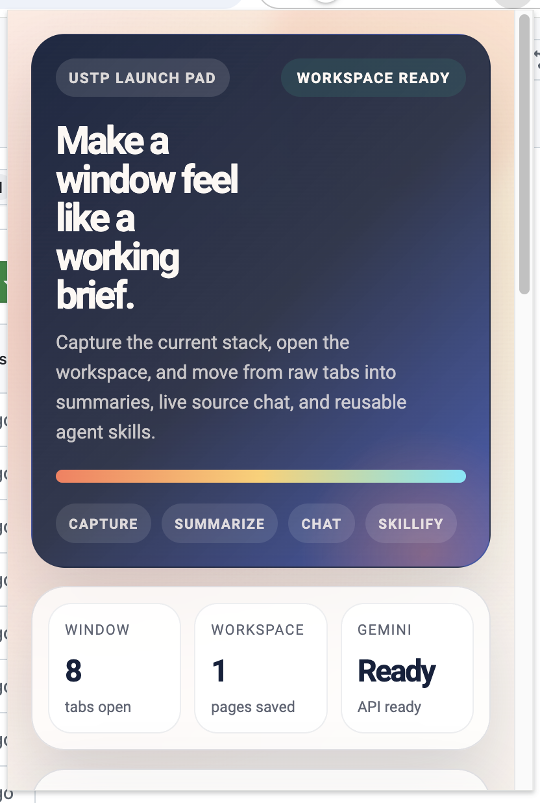
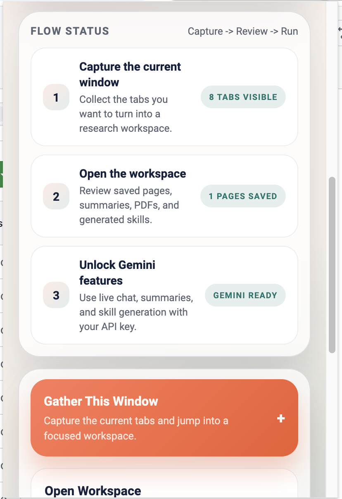
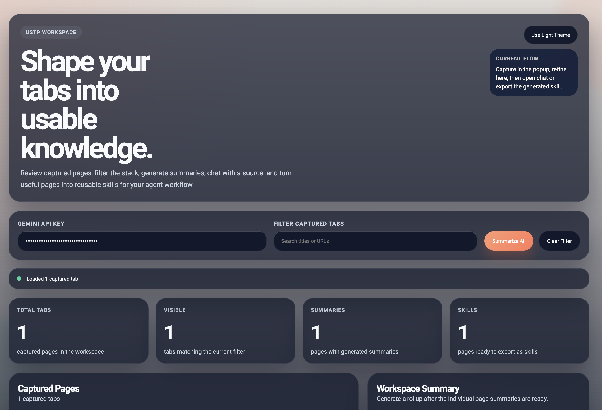
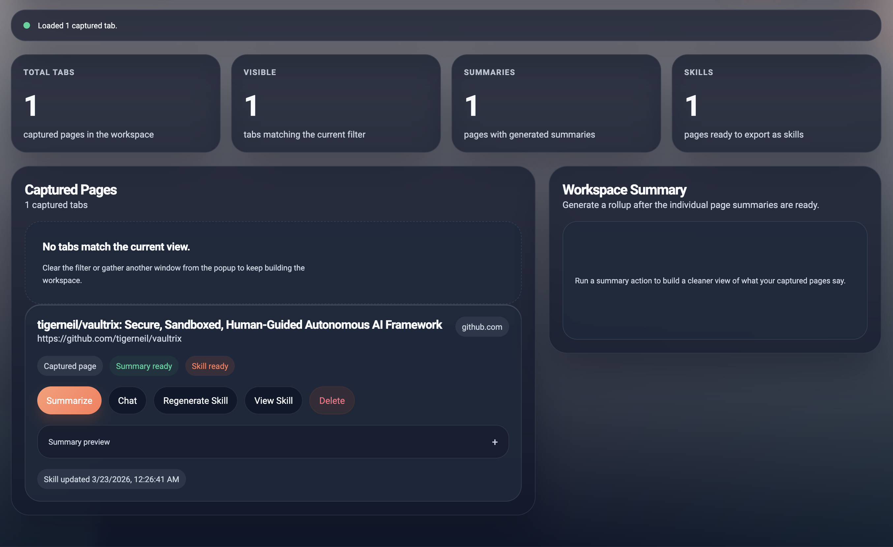
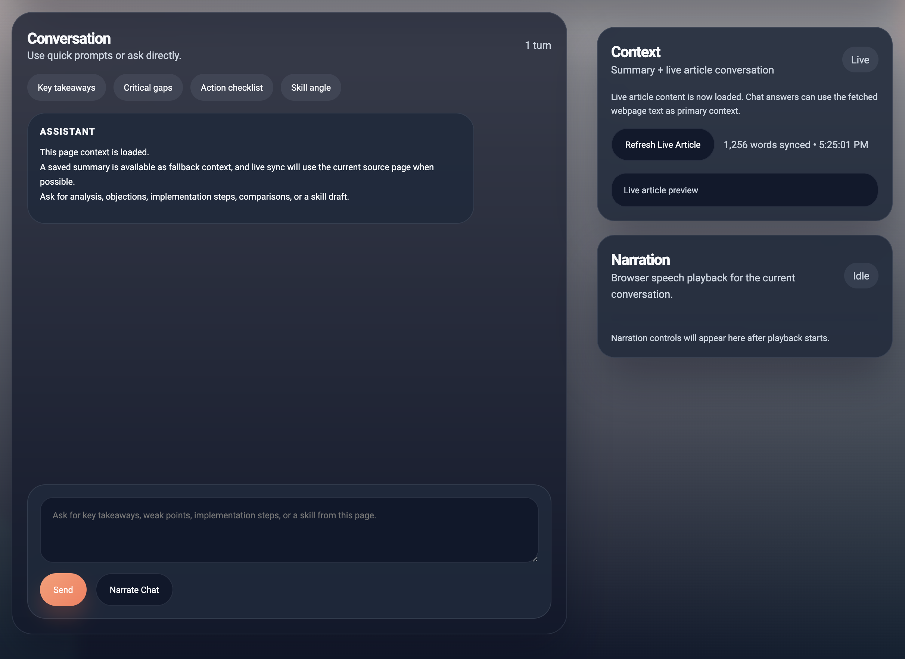

# USTP

USTP, short for "Use Superintelligent Tabot Please", is a Chrome extension for turning a noisy browser window into a working research workspace.

Instead of treating tabs like disposable clutter, USTP lets you capture a whole window, review the saved pages in one place, summarize individual sources, build a workspace brief, chat against the page context, and generate reusable `SKILL.md` files for AI-agent workflows.

## What USTP does

- Captures the current browser window into a saved workspace
- Summarizes webpages and direct PDF links with Gemini
- Builds a workspace-level rollup from captured pages
- Opens a chat view that can use the saved summary plus live webpage or PDF context
- Generates `SKILL.md` files from strong source pages
- Stores workspace state locally with Chrome extension storage

## Current feature set

- Beautiful popup launch page with workspace readiness and next-step guidance
- Saved workspace view for reviewing captured tabs
- Per-page summary generation
- Workspace summary generation
- Live article sync on the chat page
- Direct PDF link analysis for summaries, chat, and skill generation
- Page-to-skill transformation for AI-agent workflows
- Local theme support across the main extension pages

## Installation

1. Download or clone this repository to your local machine.
2. Open `chrome://extensions/` in Chrome.
3. Enable `Developer mode`.
4. Click `Load unpacked`.
5. Select the root directory of this project.
6. Open the extension popup from the Chrome toolbar.

## Basic workflow

1. Open the tabs you want to work with in one browser window.
2. Open the USTP popup and click `Gather This Window`.
3. Review the saved pages in the workspace.
4. Add your Gemini API key in the workspace when prompted.
5. Generate page summaries or a workspace brief.
6. Open chat for a page when you want question-driven analysis.
7. Generate a `SKILL.md` from a page when you want to turn the source into a reusable agent capability.

## Main screens

- `popup.html`: extension homepage / launch pad
- `tablist.html`: captured workspace and summary flow
- `chatbot.html`: page chat with live source sync

## Project structure

- `manifest.json`: Chrome extension manifest
- `popup.html` / `popup.js`: launch experience and workspace entry
- `tablist.html` / `tablist.js`: saved workspace, summaries, and skill actions
- `chatbot.html` / `chatbot.js`: source-grounded chat experience
- `skillGenerator.js`: page-to-skill generation module
- `background.js`: background service worker

## Notes and limitations

- You need access to the Gemini API for summaries, chat, and skill generation.
- Direct PDF support works best for fetchable PDF URLs.
- Protected pages, heavily client-rendered pages, or sites that block fetch requests can still produce incomplete context.
- Large live sources may be trimmed before being sent to the model.

## Screenshots

Popup launch pad:

Popup flow and actions:

Workspace overview:

Captured pages, summaries, and skills:

Source-grounded chat:

